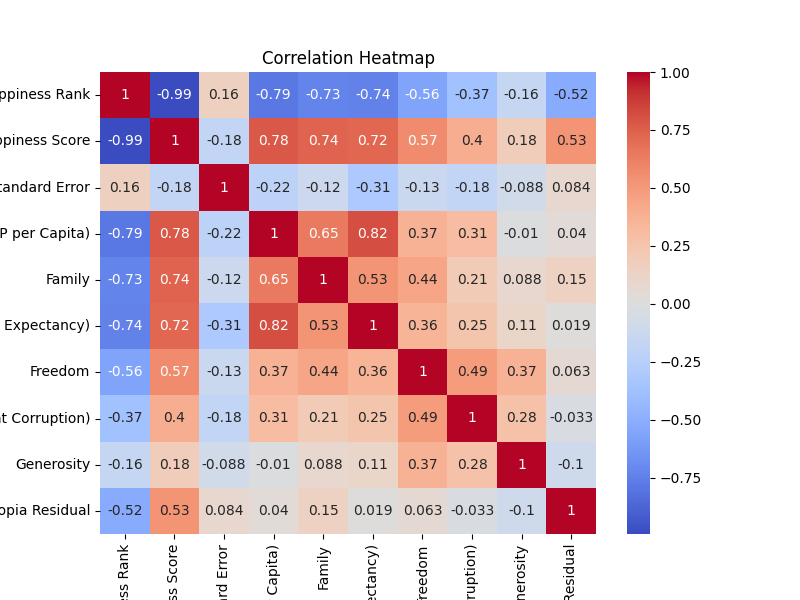
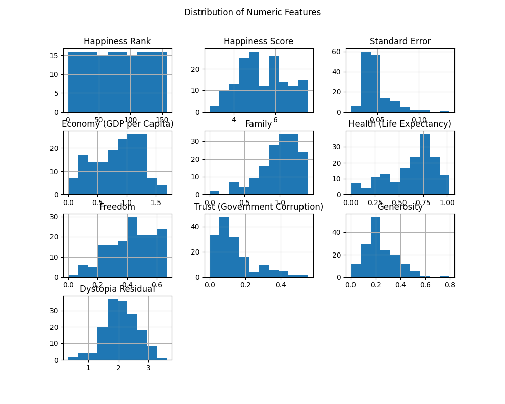
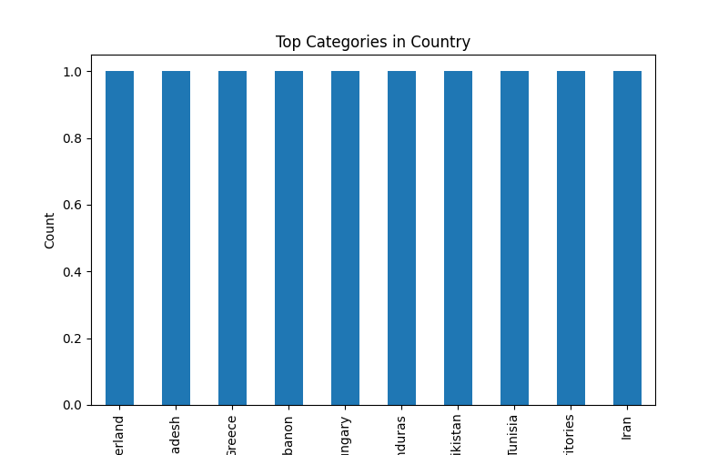
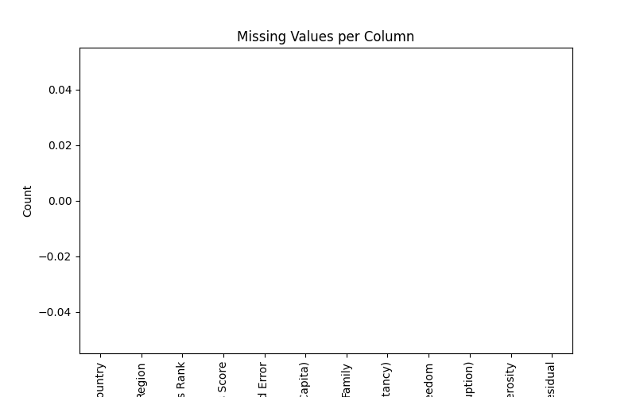

        # Dataset Overview
        The dataset contains 158 rows and 12 columns.

        # Analysis Performed
        Summary statistics, missing values, correlation, and distributions were analyzed.

        # Key Insights
        The dataset shows variation across features and some missing values.

        # Implications
        The data can be used for further analysis and decision-making.
        

## Visualizations

